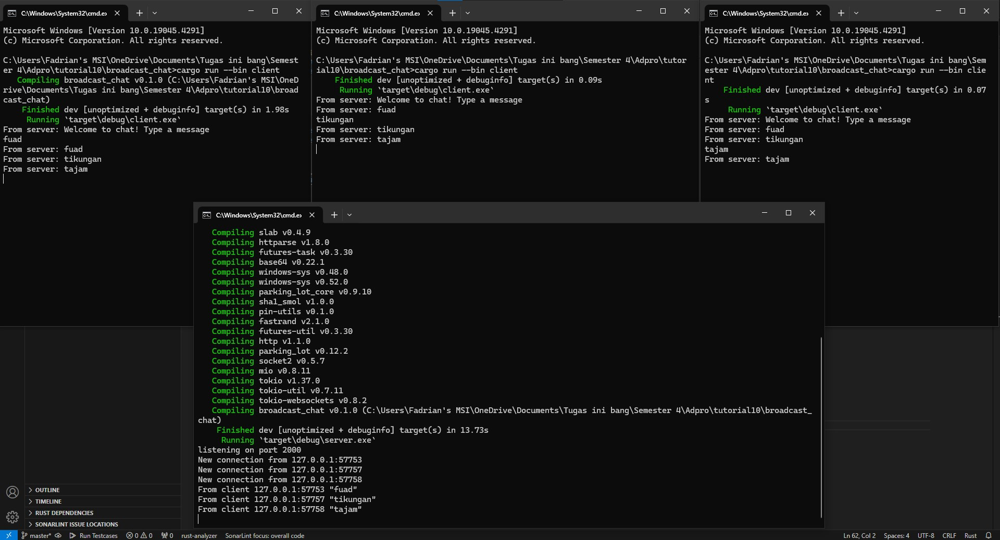
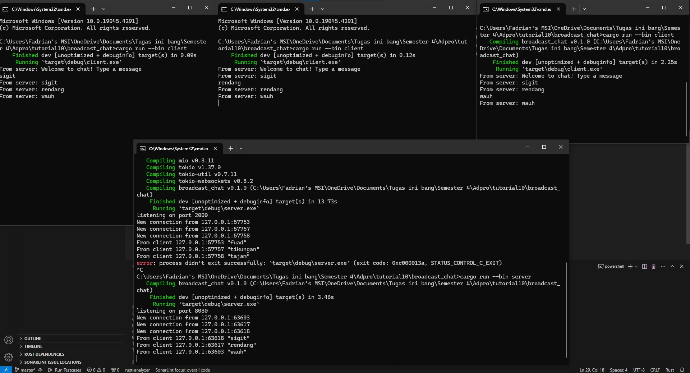
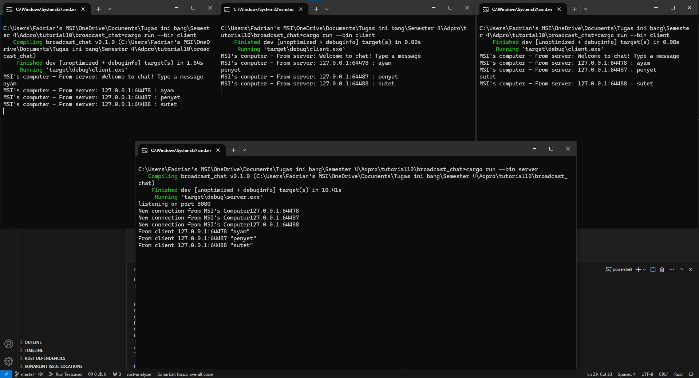

# Pemrograman Lanjut A
> Fadrian Yhoga Pratama - 2206819395

## Module 10 - Asynchoronous Programming - Broadcast Chat

## 2.1. Original code of broadcast chat

Untuk menjalankan server adalah dengan membuka 1 terminal dan menjalankan `cargo run --bin server`. Kemudian untuk menjalankan 3 client adalah dengan membuka 3 terminal dan menjalankan `cargo run --bin client` pada masing-masing terminal. Setiap client yang dijalankan akan terhubung ke satu server. Setelah terhubung saya bisa mengetik sesuatu di salah satu terminal client dan client lain dapat melihat apa yang saya ketik sebelumnya karena telah dikirimkan oleh server.

## 2.2. Modifying the websocket port

Yang harus di modify untuk menggunakan port 8080 berada di `client.rs`, yaitu pada
```rust
..
let (mut ws_stream, _) =
        ClientBuilder::from_uri(Uri::from_static("ws://127.0.0.1:8080"))
            .connect()
            .await?;
..
```
dan pada `server.rs`
```rust
...
let listener = TcpListener::bind("127.0.0.1:8080").await?;
    println!("listening on port 8080");
...
```
Keduanya harus memiliki port yang sama jika berbeda maka akan terjadi error karena client tidak bisa menemukan port yang tepat.

## 2.3. Small changes. Add some information to client

Berdasarkan gambar diatas, disini saya menambahkan dependency baru yaitu `gethostname` untuk mendapatkan informasi pada setiap client dengan memberikan nama host dari nama komputer saya (MSI's computer). Dengan begini saya tahu dari device mana yang mengirimkan message nya.